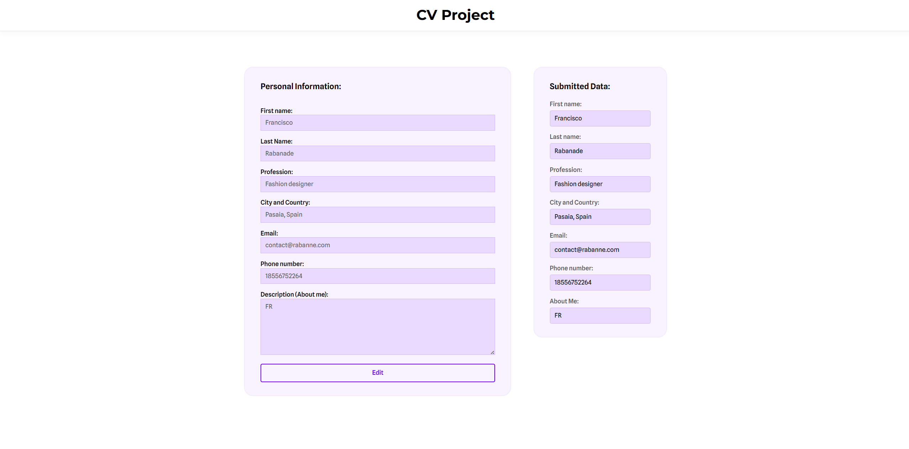

# 📄 CV Project

Интерактивное веб-приложение для создания и редактирования резюме прямо в браузере.  
Разработано с использованием **React**, **TypeScript** и **React Hook Form**.

---

## 🚀 Демо

[🔗 Открыть демо](https://cv-project-qvqv.vercel.app/)

---

## ✨ Возможности

- 🖊 Редактирование полей резюме в реальном времени
- 📄 Предпросмотр отправленных данных
- 🛠 Валидация формы с помощью React Hook Form
- 🎨 Адаптивный и минималистичный дизайн

---

## 🖼 Скриншоты

| Редактирование формы          |
| ----------------------------- |
|  |

---

## 🛠 Технологии

- **React 19**
- **TypeScript**
- **React Hook Form**
- **Vite**
- **Prettier + ESLint**

---

## 📦 Установка и запуск

```bash
# Клонировать репозиторий
git clone https://github.com/vladlenth/cv-project.git

# Перейти в папку проекта
cd cv-project

# Установить зависимости
npm install

# Запустить проект
npm run dev
```
